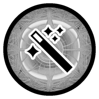

# SporeMaestro

Everything one could need for fungi spore microscopy  

## [View the Diagram](https://bradmartin333.github.io/SporeMaestro/)

- Automatic spore detection and measurements
- Identification database integration
- Clean data summary exporting
- Continuous data logging
- Calibration to USAF Target
- Image capture and focus stacking
- Motion triggered capture
- Autofocus tooling
- Support for external GPIO (Lighting, electronics, triggers)
- Cross-platform (Built on .NET 6.0)

## Why make this?

Fungi indentification, microscopy and free software go really well together.  
I believe that making this tool will enable people to delve into these topics with ease
and help grow the already flourishing community.
I also want to experiment with my own electronics dependent fungal spore research, which is why there is GPIO support.

### Extra things used here

- [Icons](https://iconmonstr.com/)
- [Recursive Diagram](https://github.com/mitxela/recursive)